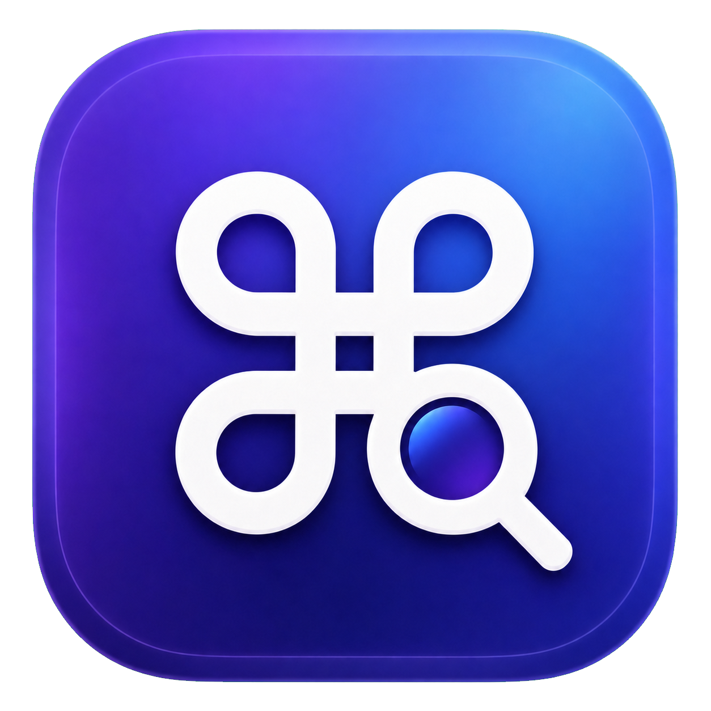
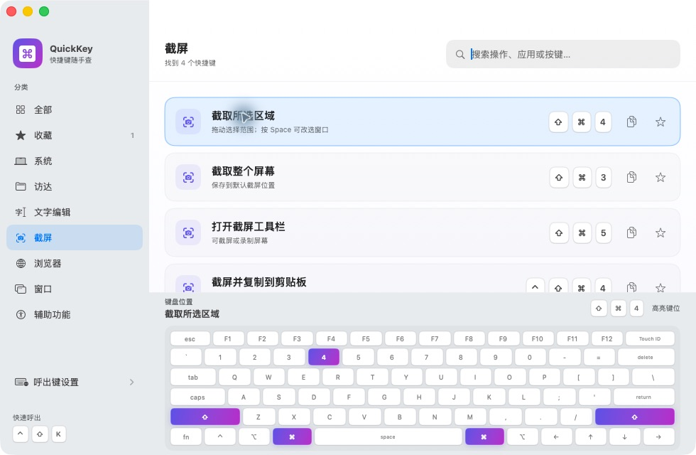
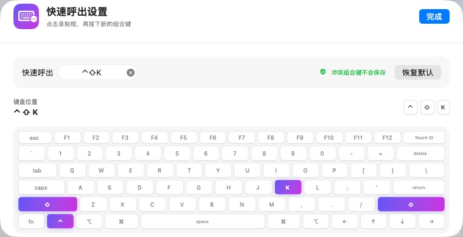

<div align="center">
  

  # QuickKey

  **在 Mac 上快速查找、理解并记住快捷键。**

  中文搜索 · 键盘位置高亮 · 自定义全局呼出 · 完全离线

  <p>
    
    
    
    
  </p>
</div>



## 为什么做 QuickKey

Mac 快捷键很多，但记住符号不等于知道按键在哪里。QuickKey 不只告诉你“按什么”，还会在完整键盘上高亮具体位置，让查找和记忆变得更直观。

所有功能均在本地运行，没有账号、网络请求或遥测。

## 功能亮点

| 功能 | 说明 |
| --- | --- |
| 🔎 中文快速搜索 | 按操作、应用、分类或按键搜索 69 个常用快捷键 |
| ⌨️ 键盘位置高亮 | 点击快捷键后，在完整 Mac 键盘上标出每一个按键 |
| ⚡ 全局快速呼出 | 默认 `⌃ ⇧ K`，在任何应用中快速打开 QuickKey |
| 🛡️ 冲突检测 | 自定义呼出键时自动阻止系统或应用已经占用的组合键 |
| ⭐ 收藏与复制 | 收藏常用操作，一键复制快捷键符号 |
| 🧭 分类浏览 | 系统、访达、文字编辑、截屏、浏览器、窗口和辅助功能 |
| 🖥️ 原生体验 | 原生 SwiftUI + AppKit，支持 Dock 与菜单栏访问 |

## 自定义呼出键

在侧边栏选择 **呼出键设置**，点击录制框并按下新的组合键。合法组合会立即保存并生效；发生冲突时，QuickKey 会显示原因并保留原来的设置。

配置过程中，键盘会同步高亮组合键的位置。



## 安装

### 下载发布版

1. 在仓库右侧打开 **Releases**。
2. 推荐下载 `QuickKey-macOS.dmg`，打开后将 QuickKey 拖到 Applications。
3. 也可以下载 `QuickKey-macOS.zip`，解压后将 `QuickKey.app` 拖入“应用程序”文件夹。
4. 第一次打开时，如 macOS 提示来源未验证，请在 Finder 中右键 QuickKey 并选择“打开”。

> 当前发布包使用本地临时签名，尚未经过 Apple 公证。源码、构建流程和 CI 均在本仓库公开可查。

### 从源码构建

要求 macOS 13 或更高版本，并已安装 Apple Command Line Tools 或 Xcode。

```bash
git clone https://github.com/john-ops-lab/QuickKey.git
cd QuickKey
chmod +x scripts/build-*.sh scripts/validate.sh
./scripts/validate.sh
./scripts/build-release.sh
open dist/QuickKey.app
```

构建脚本会自动获取锁定版本的 `KeyboardShortcuts` 依赖，并在 `dist/` 中同时生成已临时签名的应用、ZIP 和 DMG。每次 GitHub Release 都应同步发布 `QuickKey-macOS.zip` 与 `QuickKey-macOS.dmg`。

## 使用方式

- 按 `⌃ ⇧ K` 呼出 QuickKey，或点击菜单栏图标。
- 输入“截图”“窗口”“访达”等关键词快速筛选。
- 点击任意条目展开键盘位置；再次点击即可收起。
- 点击星标收藏，点击复制按钮获取快捷键符号。
- 在“呼出键设置”中更换全局组合键。

## 项目结构

```text
QuickKey
├── Assets/                  # App 图标与 README 截图
├── AppSources/QuickKey/     # SwiftUI、AppKit 与快捷键资料
├── Tests/validate.swift     # 资料完整性与键盘映射校验
├── scripts/build-app.sh     # 生成 QuickKey.app
├── scripts/build-dmg.sh     # 生成拖拽安装 DMG
├── scripts/build-release.sh # 同时生成 ZIP 与 DMG
└── scripts/validate.sh      # 运行轻量验证
```

## 验证

当前验证覆盖：

- 69 条快捷键 ID 唯一且资料完整
- 中文和多关键词搜索
- 所有浏览分类均有内容
- 所有快捷键均能映射到键盘位置
- Release 构建、应用签名和冷启动
- 自定义呼出键、冲突阻止保存和全局唤起

## 隐私

QuickKey 不收集任何数据，不连接服务器，也不需要辅助功能、输入监控、摄像头或麦克风权限。收藏和呼出键设置仅保存在 macOS 本地偏好中。

## 致谢

全局快捷键功能使用 [KeyboardShortcuts](https://github.com/sindresorhus/KeyboardShortcuts)，并随应用保留其 MIT 许可证文本。

---

<div align="center">
  Made for faster, friendlier Mac workflows.
</div>
